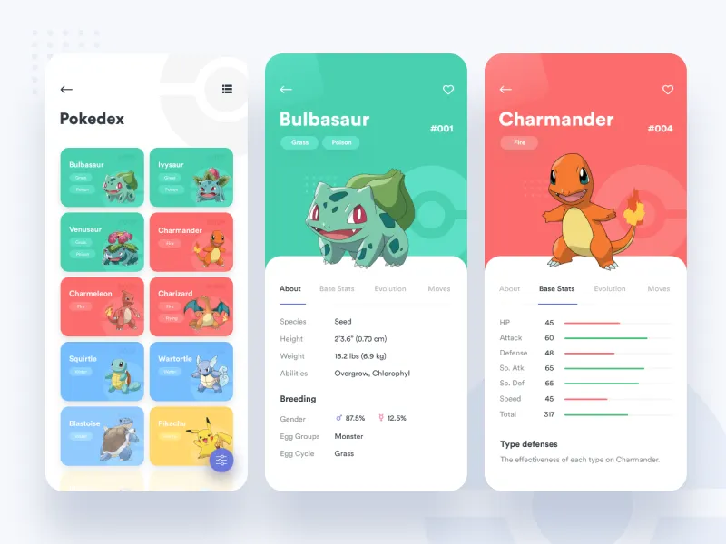

# Pokédex

Uma aplicação web desenvolvida em React que consome dados da PokéAPI para exibir informações dos 151 Pokémon da primeira geração.

## Funcionalidades

* Listagem dos Pokémon da Pokédex (1ª geração);
* Visualização detalhada de cada Pokémon;
* Exibição de tipos, habilidades, grupos de ovos e atributos base;
* Interface responsiva para diferentes tamanhos de tela;
* Navegação entre páginas utilizando React Router.

## Tecnologias Utilizadas

* React
* React Router
* JavaScript (ES6+)
* HTML5
* CSS3
* PokéAPI

## Inspiração de Design

O design da interface foi desenvolvido com base na referência visual:

A proposta foi adaptar a identidade visual da referência para uma implementação própria utilizando React e consumo de APIs.

## Objetivo Acadêmico

Este projeto foi desenvolvido como trabalho final da disciplina **Programação para Internet I**, com o objetivo de aplicar conceitos de desenvolvimento front-end, componentização, roteamento, consumo de APIs REST e responsividade.

## Autor

**Andrei Seabra**